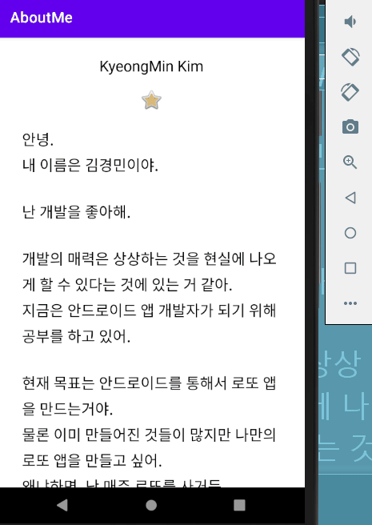
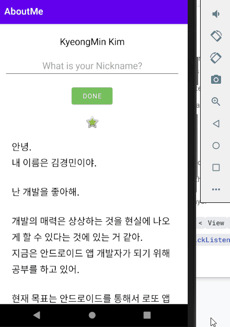

## AboutMe

-  강의 : https://developer.android.com/codelabs/kotlin-android-training-linear-layout#0

# 목표

-  나에 대해 설명하는 앱 만들기

-  텍스트가 길어질 경우, 스크롤 기능을 넣어 스크롤로 볼 수 있게 한다.

# 결과

[Virtual Device] - Nexus 5X (API LEVEL 30)

# 코딩 챌린지

-  이미지를 스크롤 안에 넣기

-  이전 결과와 달리 스크롤 시 이미지와 텍스트가 같이 움직인다. 즉, 아래로 스크롤 할 경우 이미지가 안보인다.

[Virtual Device] - Nexus 5X (API LEVEL 30)

# Add user interactivity

-  강의 : https://developer.android.com/codelabs/kotlin-android-training-interactivity#0

-  유저 이름 추가하기

-  추가한 유저 이름 변경하기

# 결과

[Virtual Device] - Nexus 5X (API LEVEL 30)

