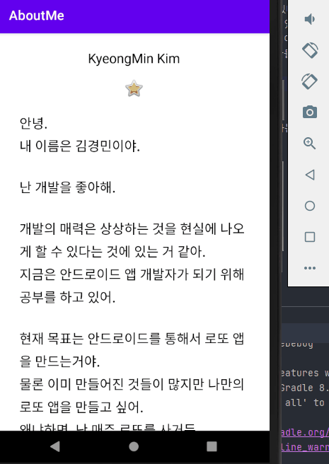

## AboutMe

-  강의 : https://developer.android.com/codelabs/kotlin-android-training-linear-layout#0

# 목표

-  나에 대해 설명하는 앱 만들기

-  텍스트가 길어질 경우, 스크롤 기능을 넣어 스크롤로 볼 수 있게 한다.

# 결과

[Virtual Device] - Nexus 5X (API LEVEL 30)

